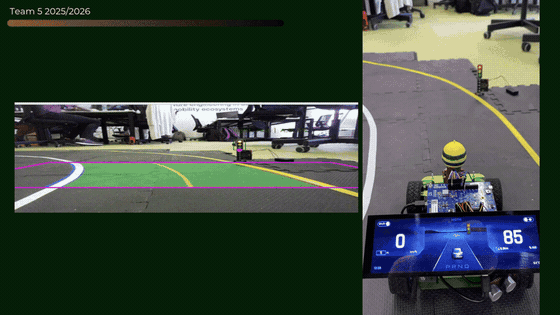
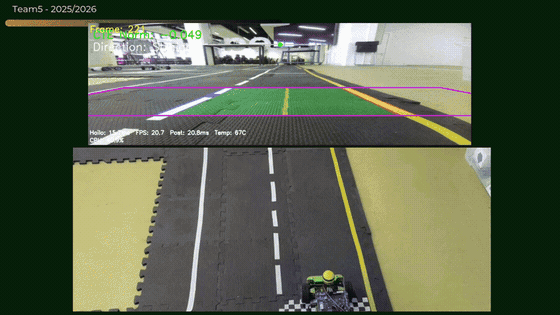
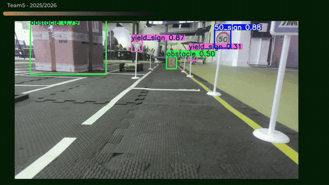
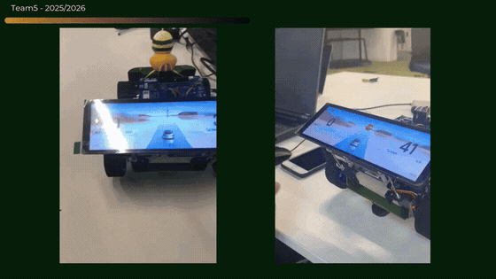
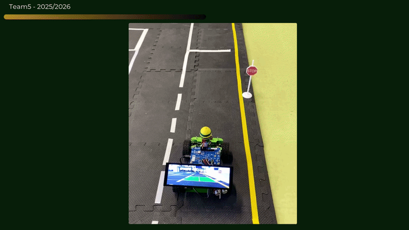
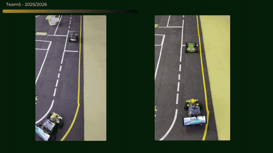
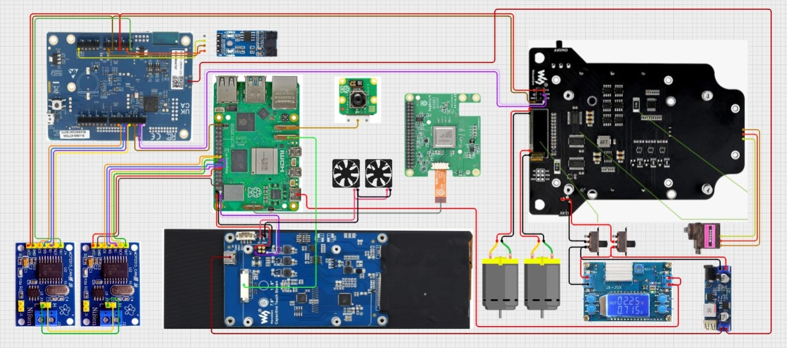

<h2 align="center">🏎️ Team5_Senna_Tech 💨 </br> <p align="center"><sub>SennaRacer</sub></p> </h2>

An autonomous 1/10-scale vehicle built on a **PiRacer chassis**, combining a **Raspberry Pi 5 + Hailo-8 AI accelerator** for perception and decision-making with an **STM32 microcontroller (ThreadX RTOS)** for real-time motor and sensor control, connected over CAN bus and Eclipse KUKSA middleware, with a Qt/QML instrument cluster as the driver-facing display.

Built by **Team 5 – SennaTech** during the **SEA:ME Portugal** program (Software Engineering in Automotive and Mobility Ecosystems). This repository is shared as an open-source reference of the full stack we built, from firmware to computer vision to UI.

<p align="center">
  
</p>

## 📑 Index
- [What the car can do](#-what-the-car-can-do)
- [Software and Hardware Architecture](#-software-and-hardware-architecture)
- [Repository structure](#️-repository-structure)
- [Getting started](#-getting-started)
- [Documentation](#-documentation)
- [Contributing guidelines](#-contributing-guidelines)
- [Team](#-team)

## 🚦 What the car can do

### 🛣️ Lane Following Assist (LFA)

Real-time lane segmentation on the Hailo-8 NPU, BEV transform, sliding-window lane fit, and PID steering feeding the CAN bus.



### 🚸 Traffic sign & obstacle detection

A second YOLO model runs in parallel on the same Hailo device to detect signs, traffic lights, crosswalks and obstacles, driving braking/avoidance behavior.



### 📊 Instrument cluster

A Qt/QML dashboard (`src/car_cluster/`) showing live speed, battery, temperature, gear and warnings, driven by real vehicle signals over KUKSA.



### 🚧 Obstacle avoidance

When an obstacle is detected inside the lane corridor, the FSM (finite state machine) shifts the trajectory reference sideways (normalized CTE offset) while the obstacle stays ahead, then smoothly returns to lane center after a wait period — with no driver intervention.



### 🚗 Adaptive Cruise Control (ACC)

Adaptive speed control that adjusts throttle based on the detected lead car's bounding-box area, keeping a safe following distance in the FOLLOW state with no driver intervention.



### 🚕 Robotaxi mission (`ADAS/Taxi_Robot/`)

An extended version of the LFA pipeline that adds a decision FSM (finite state machine), ArUco-marker-based localization, a track map, and automatic parking maneuvers, so the car can run a full pick-up/drop-off mission instead of just following a lane.


## 🧭 Software and Hardware Architecture

```
Camera ──┐
         ├─► ADAS pipeline (Hailo-8 NPU)
Joystick ┘         │  lane segmentation + object detection
                   ▼
          Post-processing (BEV, sliding windows, decision FSM)
                   │
                   ▼
             PID steering / throttle
                   │  CAN bus
                   ▼
    STM32 (ThreadX) ──► motors / servos, wheel speed, ultrasonic
                   │  CAN bus
                   ▼
         KUKSA CAN Provider ──► KUKSA Databroker (VSS)
                   │  gRPC subscribe
                   ▼
         Qt/QML instrument cluster (car_cluster)
```



`ADAS/pipeline/` is the standalone LFA pipeline (lane following + object avoidance only). `ADAS/Taxi_Robot/` builds on the same camera/inference/post-processing modules but adds `decision/`, `localization/` and `map/` to run a complete autonomous robotaxi mission, think of it as the pipeline's superset, used for the parking/pickup demo rather than plain lane-following.

## 🗂️ Repository structure

```
ADAS/
├── CARLA-Simulator/     # Closed-loop sim: dataset generation, model comparison, pre-hardware validation
├── convert_hailo/       # .pt → ONNX → .hef conversion flow for the Hailo-8
├── LFA/                 # PyTorch reference lane-detection / CTE pipeline + trained models
├── Object_Detection/    # Standalone production object detection on Hailo-8
├── pipeline/            # Production Lane Following Assist pipeline (RPi5 + Hailo-8)
├── Taxi_Robot/          # Full robotaxi mission: LFA + decision FSM + ArUco localization + parking
└── Taxi_Robot_Server/   # Backend server for the Taxi Robot mission

docker/                  # AGL cross-compilation toolchain and Docker image for the Qt cluster
docs/                    # Project documentation (hardware, ADR, git workflow, TSF, sprints, ...)
scripts/                 # CI/CD, system monitoring, and deployment scripts
src/
├── car_cluster/         # Qt/QML instrument cluster (dashboard)
├── car-control/         # Gamepad/joystick control over CAN
├── Kuksa/               # VSS mappings, CAN decoding, KUKSA docker-compose
└── threadx/             # STM32U585 firmware (ThreadX RTOS)
tests/                   # Unit, integration and system tests
INSTALL.md               # Full hardware + software build guide, from bare board to running car
```

## 🚀 Getting started

The complete, step-by-step guide to build and run the system on a car with the same components, hardware assembly, STM32 firmware flashing, AGL/Hailo image setup, Docker cross-compilation, ADAS pipeline dependencies, KUKSA middleware, and finally running the LFA or Robotaxi mission. It is in **[INSTALL.md](INSTALL.md)**.

For a quick look at individual pieces, see:
- [`ADAS/pipeline/README.md`](ADAS/pipeline/README.md) — how the LFA pipeline is structured and run
- [`ADAS/README.md`](ADAS/README.md) — overview of every ADAS module (simulator, conversion, detection, pipeline)
- [`src/car_cluster/README.md`](src/car_cluster/README.md) — instrument cluster architecture and data flow
- [`docker/README.md`](docker/README.md) — cross-compilation environment for the Qt cluster

## 🧾 Documentation

All technical and process documentation lives in [`docs/`](docs/), including hardware wiring guides, Architecture Decision Records, the Trustable Software Framework (TSF) traceability, and per-topic write-ups (KUKSA, CARLA, MPC, energy, etc.). Start at [`docs/README.md`](docs/README.md) for the full index.

## 🧭 Contributing guidelines

The branching strategy, commit message conventions and pull request process the team followed are documented in [`docs/GITHUB/git_guidelines.md`](docs/GITHUB/git_guidelines.md).

## 👥 Team

<table>
<tr>
<td align="center">
  <a href="https://github.com/yasminefontenele"></a>
  <br><sub><b>Yasmine</b></sub>
</td>
<td align="center">
  <a href="https://github.com/vivaccar"></a>
  <br><sub><b>Vinicius</b></sub>
</td>
<td align="center">
  <a href="https://github.com/jose5556"></a>
  <br><sub><b>Jose</b></sub>
</td>
<td align="center">
  <a href="https://github.com/marcelofassbinder"></a>
  <br><sub><b>Marcelo</b></sub>
</td>
<td align="center">
  <a href="https://github.com/nicoleoliveiraa"></a>
  <br><sub><b>Nicole</b></sub>
</td>
<td align="center">
  <a href="https://github.com/Hellom-World"></a>
  <br><sub><b>Hellom</b></sub>
</td>
</tr>
</table>
