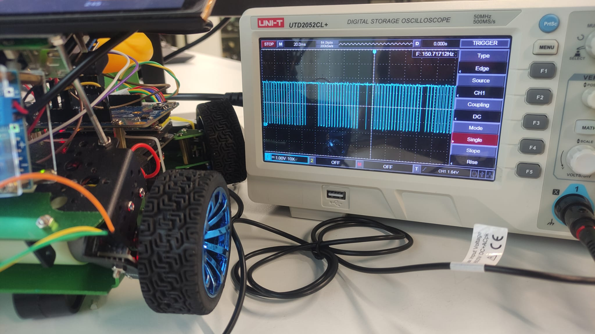
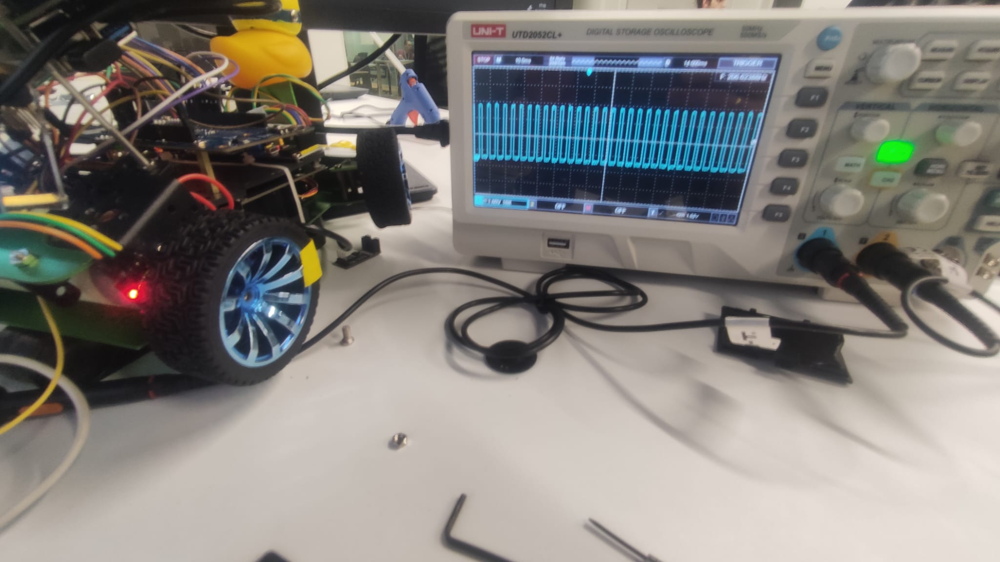

# Physical Validation and Hardware Adjustment Report (Case 200)

**Date:** February 5, 2026
**Equipment:** Digital Oscilloscope

## 1. Context and Initial Problem
During speed sensor testing, inconsistencies in readings were detected. Before applying any software treatment, a bench analysis with an oscilloscope was performed to validate the integrity of the electrical signal from the LM393 sensor.

## 2. Oscilloscope Analysis (Before Adjustment)
Initial analysis revealed that the signal had intermittent gaps. Even with the motor at constant rotation, the sensor failed to generate pulses at regular intervals.

*   **Visual Evidence (Failure):**
    
    *(Video demonstrating real-time pulse loss)*

## 3. Diagnosis and Mechanical Intervention
The problem was identified as a physical misalignment between the optical sensor and the encoder disc. Incorrect positioning prevented the light beam from being adequately and constantly interrupted during rotation.

*   **Action:** Mechanical readjustment of the sensor position and tightening of the brackets to ensure ideal optical alignment.

## 4. Results (After Adjustment)
After the mechanical intervention, the signal stabilized completely. With the motors at maximum speed, the parameters observed on the oscilloscope were:

*   **Pulse Width (High Level):** ~1.8 ms.
*   **Pulse Interval (Period):** ~5.0 ms.
*   **Quality:** Clean and regular signal, with no detectable electrical noise or interference (EMI) peaks.

*   **Visual Evidence (Success):**
    
    
    [🎥 Watch Video Evidence (MP4)](../../../pictures/speed_sensor_succes_oscilloscope.mp4)
    *(Video demonstrating constant signal after adjustment)*

---

## Appendix: Technical Specification for Noise Characterization

**Equipment:** UNI-T UTD2052CL+ Digital Oscilloscope  
**Target:** LM393 Comparator Output (Pulse Sensor)

### 1. Hardware Connection
To ensure signal integrity and prevent equipment damage, the **Parallel Measurement** method must be followed:

*   **Probe (CH1):** Connected directly to the LM393 output pin or the microcontroller input node (STM32).
*   **Ground Clip (Alligator):** Connected to the common circuit GND.
*   **Attenuation:** Probe and channel configuration set to **10X** (to minimize capacitive load on the circuit).

> **⚠️ SAFETY NOTE:** Never connect the ground clip to signal points (VCC or Output), as it is internally grounded to the oscilloscope chassis, which will cause a short circuit.

### 2. Instrument Configuration (UTD2052CL+)
The parameters below were optimized to capture transient mechanical bouncing and electrical ringing events:

**Vertical (Amplitude)**
*   **Scale:** 1.00V/div or 2.00V/div (adjust so the signal occupies 50-70% of the screen).
*   **Coupling:** DC.
*   **Position:** Set 0V level to the first bottom grid line.

**Horizontal (Time)**
*   **Time Base:** Initially at 500μs/div.
*   **Post-Adjustment:** After capture, expand (zoom) to observe details at 50μs or 100μs scale.

**Trigger**
*   **Type:** Edge.
*   **Source:** CH1.
*   **Slope:** Rising.
*   **Level:** Set to approximately 50% of the signal amplitude (e.g., 1.6V for 3.3V signals).
*   **Mode:** **Single** (Accessed via the Trigger menu). This mode stops scanning after the first detected pulse, freezing the image for analysis.

### 3. Measurement Procedure
1.  Arm the oscilloscope by selecting **Single** mode (Status: *Ready*).
2.  Actuate the sensor/mechanical device to generate the pulse.
3.  After automatic capture (Status: *Stop*), use the **CURSOR** function:
    *   **Cursor A:** Positioned at the start of the first rising transition.
    *   **Cursor B:** Positioned at the end of the last stable oscillation (noise/bouncing).
    *   The resulting **$\Delta T$** represents the total noise duration.

---
**Test Status: PASS**