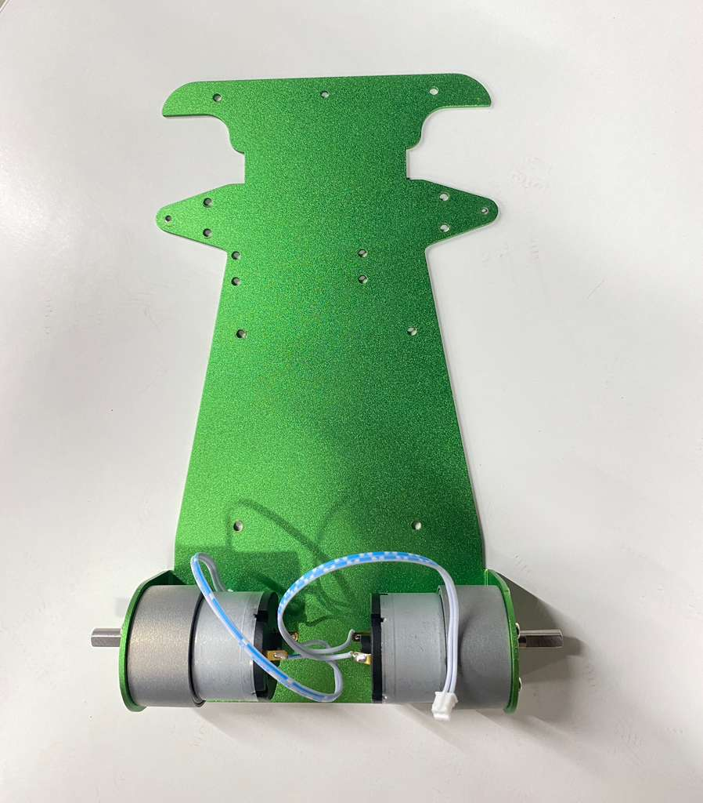
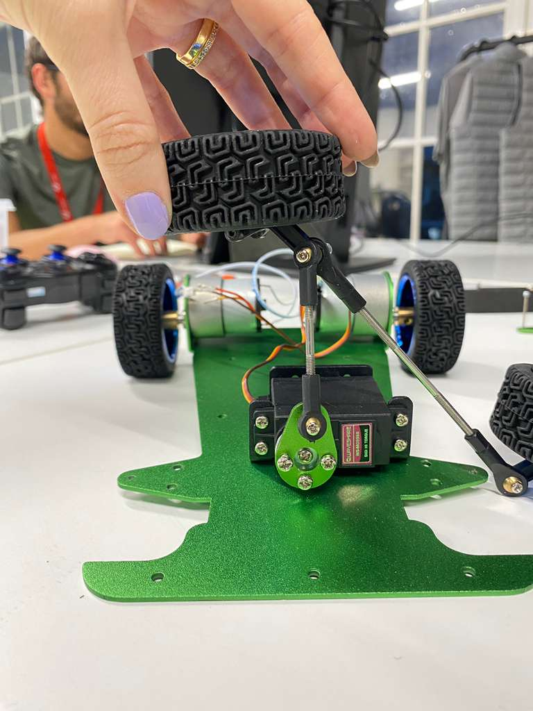
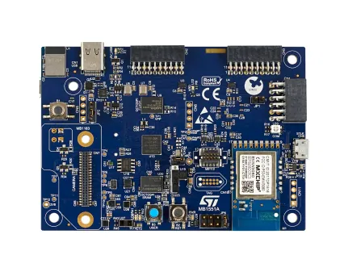
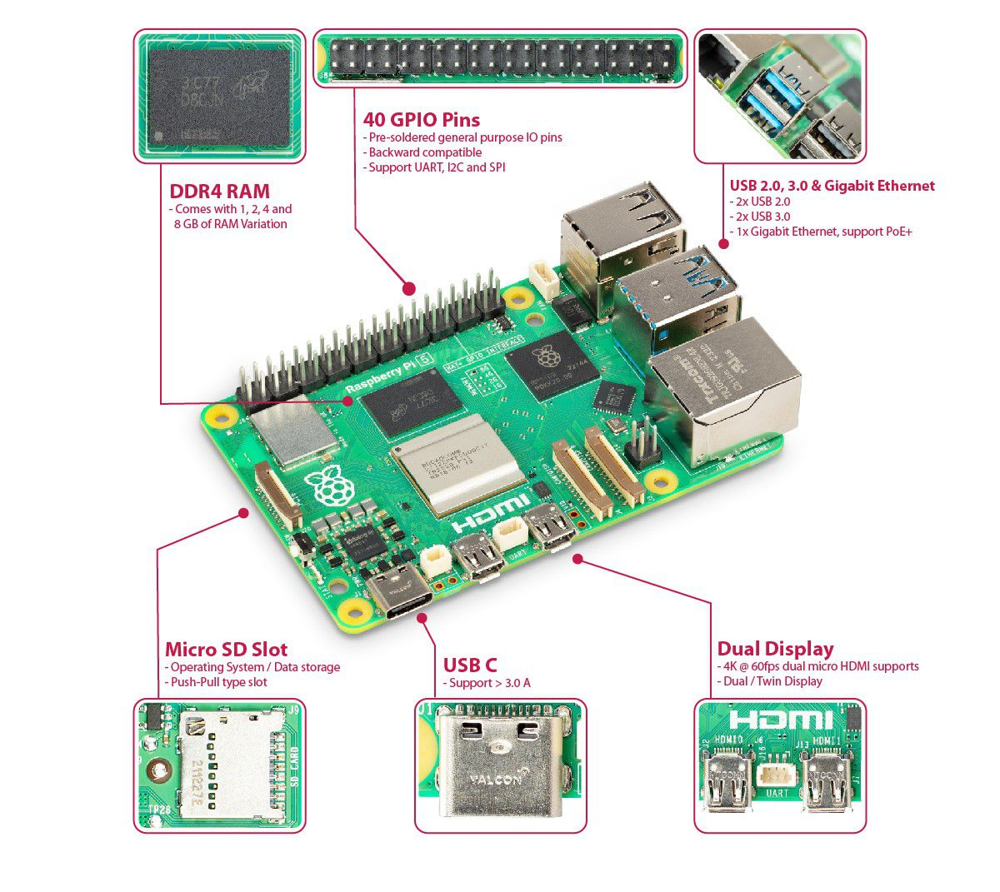
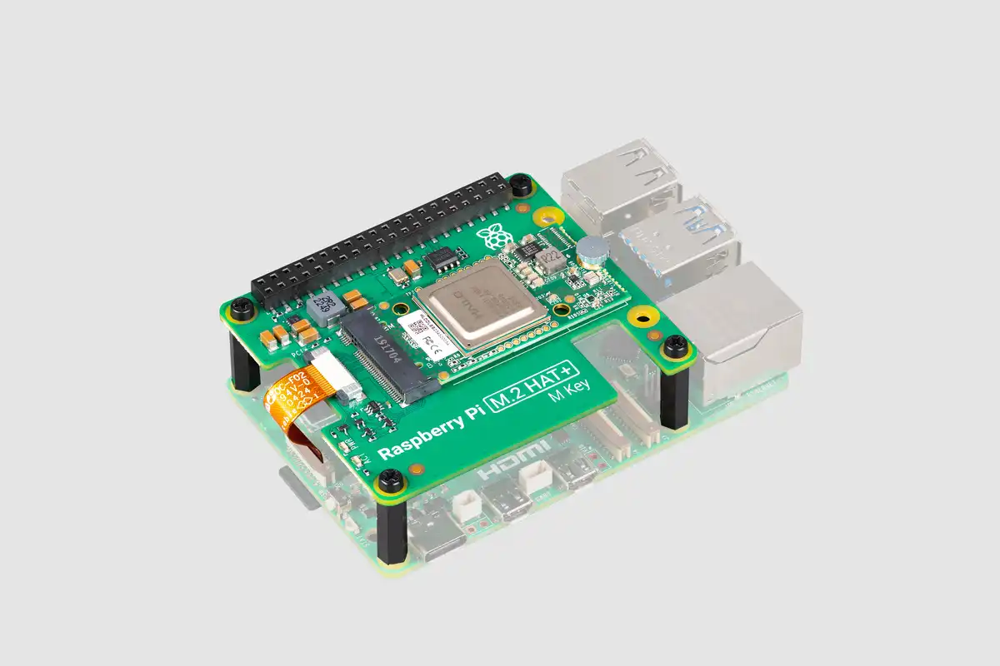
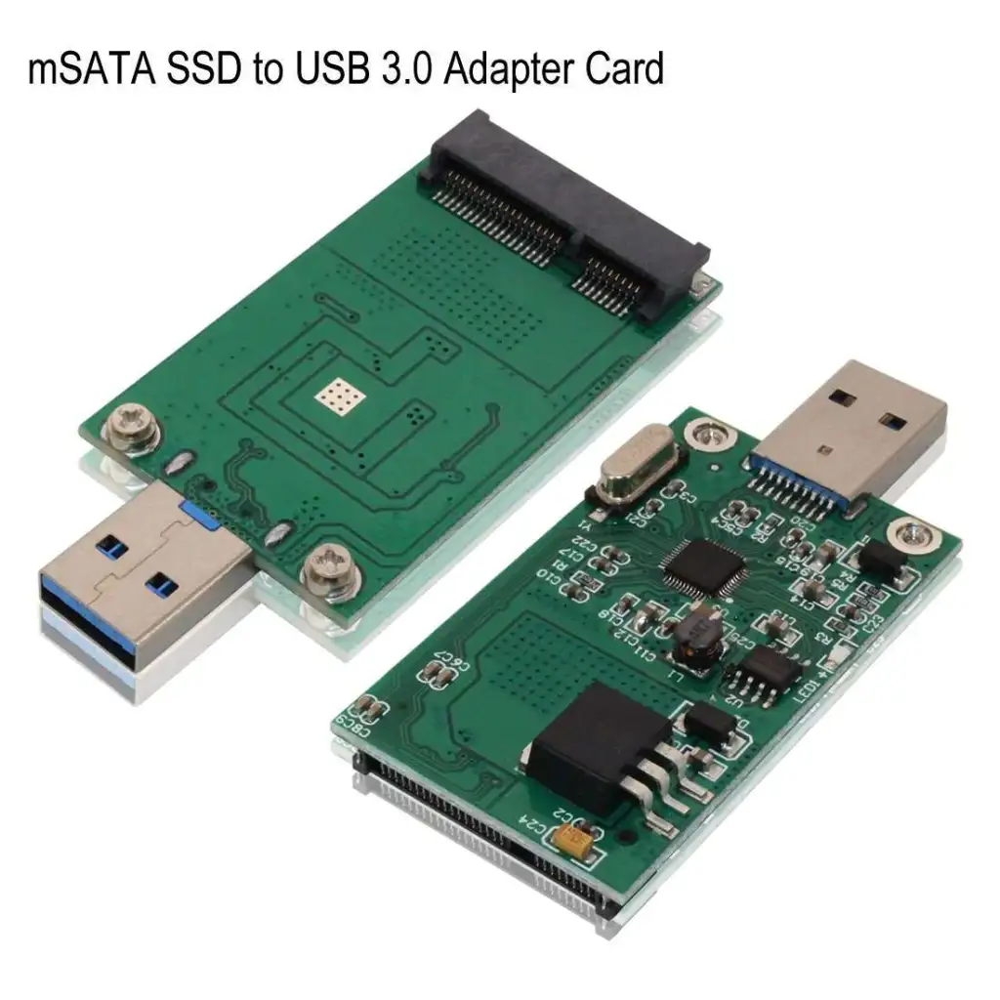
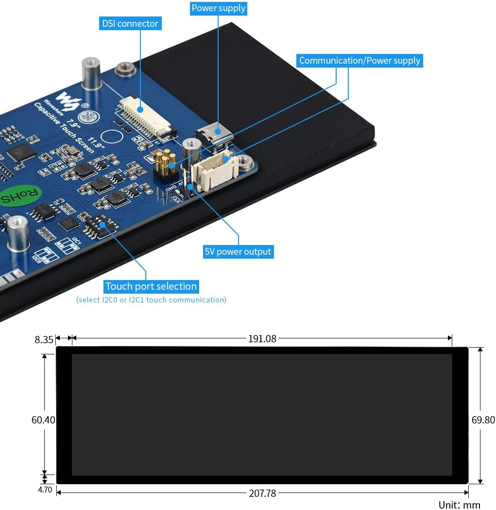

# Component Datasheets and Specifications

This document provides detailed information and specifications for each electronic component used in the project, serving as a central reference for design, power analysis, and troubleshooting. The structure is designed to be easily parsed for generating power budget spreadsheets.

## Key Explanations for Power Budgeting:

- **Component:** The name and brief description of the electronic component.
- **Voltage (V):** The nominal operating voltage of the component in Volts.
- **Max Current (A):** The maximum current consumption of the component in Amperes, typically under peak or stall conditions.
- **Peak Factor:** A multiplier applied to the Max Current to account for transient current spikes, especially for inductive loads. A value of 1.0 means no peak factor is applied.
- **Margin (%):** A safety margin percentage added to the calculated power to account for variations, aging, and unforeseen circumstances.
- **Source/Datasheet:** Links to official datasheets or relevant documentation for the component.
- **Notes:** Any additional important information, assumptions, or context regarding the component's power characteristics.

---

### JetRacer AI Kit On-Board Peripherals

- **Component:** JetRacer Board Peripherals (ADC, OLED, PWM Controller)
- **Voltage (V):** 5
- **Max Current (A):** 0.5
- **Peak Factor:** 1.0
- **Margin (%):** 20
- **Source/Datasheet:**
    - [JetRacer AI Kit Wiki - Hardware Setup](https://www.waveshare.com/wiki/JetRacer_AI_Kit#1._Hardware_setup)
    - [JetRacer Schematic PDF](https://files.waveshare.com/upload/4/4a/JetRacer_Schematic.pdf)
- **Notes:** This represents the combined quiescent current of the on-board electronics (ADS1115, SSD1306, PCA9685) on the JetRacer power management board, excluding the Jetson Nano and motors. It is considered a non-inductive load.

---

### DC Motors (2x 37-520)

- **Component:** DC Motor (37-520)
- **Voltage (V):** 12
- **Max Current (A):** 2.3
- **Peak Factor:** 1.5
- **Margin (%):** 30
- **Source/Datasheet:**
    - [ram-e-shop.com - 37-520 DC gearmotor](https://vertexaisearch.cloud.google.com/grounding-api-redirect/AUZIYQER23ss2Z6qJqHMHEcjrPj7URNbNO_E_XwiWr6IOZfdeT8gLybVXyHKsVzkdodWipP2qhwD-Bf-j6kbxe_u8y2Tgl1JfO0KQ6YFfGLhTDfMvk8AHsChceyeQc5MDC7ntqng4zlCFV8piyTIt-ZyVzOfwzp-QTft0QjZ6HXP8ky0gtsDNUVo4Q9huw2z7msTJBp2GNl6vNBD1RZuC3tBBjvd1Ai46Xt-siEMLiTyvI70-c5n1s-DBKA=)
- **Notes:** The PiRacer uses two of these motors. They are inductive loads. The stall current (2.3A) is used as the Max Current. A peak factor of 50% (1.5) and a safety margin of 30% are applied as per `issue_76` recommendations. The spreadsheet should account for two units.

---

### Servo Motor (MG996R)

- **Component:** Servo Motor (MG996R)
- **Voltage (V):** 5
- **Max Current (A):** 2.5
- **Peak Factor:** 1.5
- **Margin (%):** 30
- **Source/Datasheet:**
    - [waveshare.com - PiRacer AI Kit](https://vertexaisearch.cloud.google.com/grounding-api-redirect/AUZIYQG1tkVPoCbrWqZzDY6dnHYWYG2kWFpXNf-O01QPc_hTHvJSEEtLpWK-e34rw6FcyGBXooLd_4s9DzJzLovbXRqDkrTclQI6Y7i2lcoXcChdMZaaxvxs7oReCsfXapVmv7w2JQdhpxg=)
    - [rhydolabz.com - MG996R Datasheet](https://vertexaisearch.cloud.google.com/grounding-api-redirect/AUZIYQF0T7NpK3gL1hGLgTxAu5NpUx7EkogxfFcazvcQtW3wqCje2VaUh_yEDONZf509_wjO14la2l0Fp6UDtS0Ijb7RVPLncQotKy8TCZ-AJ8eoTZi26dbeTbkdwxq8R2mqisgsd1-UR2sNbZMA-MohRmmoKM_BQFUiYw==)
- **Notes:** This servo is an inductive load. The stall current (2.5A) is used as the Max Current. A peak factor of 50% (1.5) and a safety margin of 30% are applied.

---

### STM32 Development Board (B-U585I-IOT02A)

- **Component:** STM32 Dev Board (B-U585I-IOT02A)
- **Voltage (V):** 5
- **Max Current (A):** 0.5
- **Peak Factor:** 1.0
- **Margin (%):** 20
- **Source/Datasheet:**
    - [ST.com Product Page](https://www.st.com/en/evaluation-tools/b-u585i-iot02a.html)
- **Notes:** This is a digital electronic load, not an inductive one, so a peak factor is not applied. The maximum current of 500 mA represents the board's consumption under high load. A standard safety margin of 20% is recommended.

---

### Raspberry Pi 5

- **Component:** Raspberry Pi 5
- **Voltage (V):** 5
- **Max Current (A):** 5.0
- **Peak Factor:** 1.0
- **Margin (%):** 20
- **Source/Datasheet:** [Raspberry Pi 5 Product Brief](https://datasheets.raspberrypi.com/rpi5/raspberry-pi-5-product-brief.pdf)
- **Notes:** The Raspberry Pi 5 requires a 5V power source. A 27W USB-C PD power supply (5.1V at 5A) is recommended, allowing the board to draw up to 5A. If a 5V 3A power supply is used, the current available to USB ports is limited to 600mA, which can cause stability issues with power-hungry USB peripherals.

---

### Hailo-8L AI Accelerator HAT (PCIe)

- **Component:** Hailo-8L AI Accelerator HAT
- **Voltage (V):** 5
- **Max Current (A):** 1.0
- **Peak Factor:** 1.0
- **Margin (%):** 20
- **Source/Datasheet:**
    - [Raspberry Pi AI HAT+ Product Brief](https://datasheets.raspberrypi.com/ai-hat-plus/raspberry-pi-ai-hat-plus-product-brief.pdf)
    - [Raspberry Pi 5 PCIe FPC Connector Specification](https://www.raspberrypi.com/documentation/computers/raspberry-pi-5.html#pcie-fpc-connector)
- **Notes:** The HAT receives 5V from the Raspberry Pi's PCIe interface and converts it internally to 3.3V. The HAT's maximum power consumption is 5W, which requires 1.0A from the 5V line. **CRITICAL:** The RPi 5's PCIe interface is limited to exactly 1A. Powering the HAT directly from the RPi will cause it to operate at the absolute limit of the interface, with no safety margin. This can lead to system instability and HAT shutdowns under load. For stable operation, an external 3.3V power source is strongly recommended.

---

### mSATA SSD via USB 3.0 Adapter

- **Component:** mSATA SSD via USB 3.0 Adapter
- **Voltage (V):** 5
- **Max Current (A):** 1.1
- **Peak Factor:** 1.0
- **Margin (%):** 20
- **Source/Datasheet:** [iABC mSATA SSD Adapter To USB 3.0](https://iabcssd.com/product/iabc-msata-ssd-adapter-to-usb-3-0-50mm-mini-pcie-solid-state-drive-reader-converter/)
- **Notes:** Power is supplied by the Raspberry Pi 5's USB 3.0 port. The adapter converts the 5V from the USB port to 3.3V for the mSATA SSD. The combined maximum consumption is ~1.1A from the 5V USB line (including regulator inefficiency). **CRITICAL:** The RPi 5's USB ports can deliver up to 1.6A *only if* the RPi is powered by a 5V/5A USB-C PD supply. If a non-PD or insufficient power supply is used, the USB current is limited to 600mA, which will lead to the SSD not being detected, I/O errors, data corruption, or general system instability.

---

### Waveshare 7.9inch DSI LCD

- **Component:** Waveshare 7.9inch DSI LCD
- **Voltage (V):** 5
- **Max Current (A):** 0.6
- **Peak Factor:** 1.0
- **Margin (%):** 20
- **Source/Datasheet:**
    - [Waveshare Wiki](https://www.waveshare.com/wiki/7.9inch_DSI_LCD)
- **Notes:** This is a capacitive touch screen with a resolution of 400x1280. It connects to the Raspberry Pi's DSI port. It is a non-inductive load, so a peak factor is not applied. A standard safety margin of 20% is recommended.
