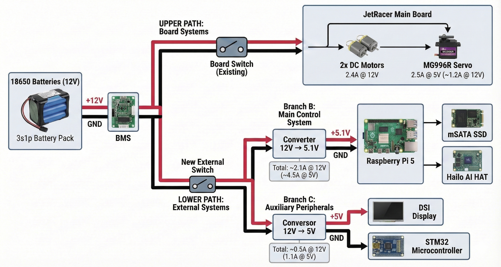

# Power Architecture Solution

## 1. Original Problem Identified

The initial analysis of the project's power system, documented in [**energy_consumption_analysis.md**](energy_consumption_analysis.md), and the identification of critical components in [**components_datasheet.md**](components_datasheet.md) revealed multiple deficiencies that compromised the robot's stability, safety, and performance. The main problems were:

*   **Battery (Cells):** The existing `3s1p` pack (Botnroll 3200mAh) was critically insufficient for the system's power demand, causing instability and shutdowns.
*   **Integrated BMS:** The BMS (S-8254AA) had an overcurrent limit of approximately `~7.5A`, which, although protecting the cells, was a bottleneck for the system's peak demand (~10.8A), as detailed in the [consumption analysis](energy_consumption_analysis.md).
*   **Motor Driver:** The TB6612FNG driver, with a continuous limit of 1.2A per motor, was undersized for the motors' 2.3A stall current (see [component datasheet](components_datasheet.md)).
*   **Raspberry Pi 5 Power Supply:** The Pi 5 could not supply enough power to high-consumption peripherals (SSD, Hailo HAT) through its USB and PCIe ports due to internal hardware limits, a critical point identified in the [energy consumption analysis](energy_consumption_analysis.md).

## 2. Proposed Power Architecture (Solution)

A new power architecture was developed to address all identified problems, maintaining safety as a top priority and respecting the main board's limitations.

### **Proposed Power Distribution Diagram**

**Estimated Total 12V Line Consumption:** Based on the detailed branches, the total estimated current consumption on the 12V line is **~6.2A**. This value is within the BMS's overcurrent protection limit, which is approximately **~7.5A**.

### **Components and Power Flow:**

1.  **Power Source (Onboard):**
    *   **Cells:** 3x Samsung INR18650-30Q (in the existing battery holder). These high-performance cells (15A continuous) solve the battery capacity problem.
    *   **Protection:** The board's integrated BMS (with a total limit of `~7.5A`) continues to be used as central protection.

2.  **Protected 12V Output Point:**
    *   Power is drawn from the "Eb+" and "GND" points on the board, after the integrated BMS.

### **Power Control and Switches**

The power control architecture will be divided into two switches with distinct functions to ensure safety and control:

*   **Onboard Switch (Existing):** The switch already present on the board maintains its original function, controlling the power to the integrated systems (like the TB6612FNG motor driver). This switch does **not** cut power at the 12V derivation.

*   **New Master Switch (External):** To ensure a complete power cut to the new circuit, a **new external switch** will be added to the 12V derivation.
    *   **Function:** This switch will act as the main switch for the entire external control system. When turned off, it will cut power to the step-down converters and, consequently, to the Raspberry Pi 5, the display, and all other peripherals powered by them.

3.  **Branch A1: DC Motors**
    *   **Consumer:** Onboard Motor Driver (TB6612FNG).
    *   **Estimated Current (12V):** Maximum consumption of **2.4A @ 12V**, software-controlled (1.2A per motor).
    *   **Solution:** The motors' consumption will be limited via software (PWM) to protect the driver and ensure the total system consumption does not exceed the `~7.5A` of the BMS.

4.  **Branch A2: Servo Motor**
    *   **Consumer:** Servo Motor MG996R, powered by the board's own 5V regulator.
    *   **Estimated Current (5V):** Maximum (stall) consumption of **2.5A @ 5V**.
    *   **Estimated Current (12V):** The servo's consumption reflects approximately **~1.2A @ 12V** on the main power source (considering the onboard regulator's efficiency).

5.  **Branch B: Raspberry Pi 5 & High-Performance Peripherals**
    *   **Estimated Current (5V):** Total consumption of **~4.5A @ 5V** for the Raspberry Pi 5, SSD, and Hailo HAT.
    *   **Estimated Current (12V):** This branch's consumption reflects approximately **~2.1A @ 12V** on the main power source.
    *   **Converter 1:** New 12V to 5.1V @ 5A Step-Down Converter.
    *   **Power Supply:** The Raspberry Pi 5, the SSD Adapter (via USB), and the Hailo AI HAT Module (via PCIe) will be powered by this circuit. (Note: The Hailo will operate at the 1.0A limit of the PCIe port).

6.  **Branch C: Auxiliary Peripherals**
    *   **Estimated Current (5V):** Total consumption of **1.1A @ 5V** for the Display and the STM32 Microcontroller.
    *   **Estimated Current (12V):** This branch's consumption reflects approximately **~0.5A @ 12V** on the main power source.
    *   **Converter 2:** New 12V to 5V @ 4A Step-Down Converter.
    *   **Power Supply:** For the Display and the STM32 Microcontroller.

## 3. Conclusion and Justification

The new power architecture ensures that the robotics system has a robust and stable primary power source. By using external converters and managing consumption through software/firmware, all major bottlenecks are addressed.

Although the Hailo module will operate at the limit of the PCIe port, this solution offers the maximum possible performance and stability within the constraints of the board's integrated hardware, ensuring the overall safety and reliability of the project.