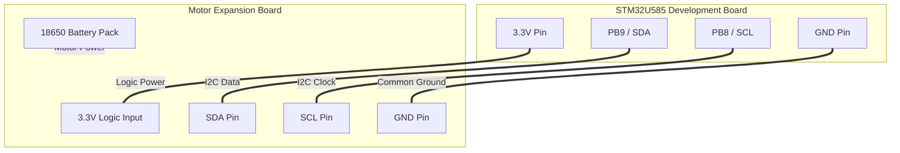

# Motor Control Migration to STM32U5 - Hardware Analysis and Connections

## 1. Overview
This document describes the analytical process and technical decisions made to migrate the motor control interface (PCA9685) from the Raspberry Pi 5 to the STM32U585.

## 2. Technical Investigation and Findings

### Expansion Board Requirements (Target)
By analyzing the Expansion Board interface, we observed that the PWM controller chip (PCA9685) requires an external source for its communication logic.
- **Fact:** The board uses a 6-pin header for signals and logic power.
- **Discovery:** We confirmed that the board's logic operates at 3.3V and that, in the original setup, this power was actively provided by the Raspberry Pi.
- **Conclusion:** It is mandatory for the STM32U5 to provide the **3.3V** line to power the expansion board's logic interface, in addition to the data (SDA) and clock (SCL) signals.

>   
> *Placeholder: Photo of the 6-pin header on the Expansion Board showing the labels (VCC, GND, SDA, SCL).*

### Resource Mapping on STM32U5 (Controller)
We inspected the firmware configuration and the physical layout of the B-U585I-IOT02A board to identify the ideal I2C interface.
- **Research:** The `I2C1` peripheral is enabled and mapped to pins **PB8 (SCL)** and **PB9 (SDA)**.
- **Location:** These pins are accessible on the Arduino connector (**CN13**).
- **Power Management:** The **3.3V** logic supply pin on the STM32 is now **shared** between the Speed Sensor (LM393) and the Expansion Board. This duplication is safe as the total current draw for both remains well within the STM32 regulator's limits (~20mA total).
- **Conflict Validation:** we verified that these pins do not interfere with the CAN bus (SPI1) or the speed sensor (PB0).
- **Conclusion:** Using pins PB8/PB9 on the CN13 connector is safe and compatible with the current system.

>   
> *Placeholder: Photo of the STM32 board highlighting pins D14 (SDA) and D15 (SCL) on the CN13 connector.*

## 3. Physical Implementation (Wiring Diagram)
The diagram below details the physical bridge between the STM32U5 and the Expansion Board, consolidating the findings from the previous analyses.

>   
> *Placeholder: Photo of the complete wiring setup connecting the STM32 to the Expansion Board.*

## 4. Safety Notes
*   **Power:** The motors must be powered exclusively by the batteries integrated into the Expansion Board.
*   **Isolation:** The Raspberry Pi must be disconnected from the Expansion Board before connecting the STM32 to avoid voltage or bus conflicts.

### Load & Address Analysis (3.3V Logic Rail)
We verified the total current draw on the STM32's 3.3V regulator and mapped the I2C addresses of all devices on the bus.

| Component | Function | I2C Address | Est. Logic Current |
| :--- | :--- | :--- | :--- |
| **PCA9685** | PWM Control | `0x40` (Servo), `0x60` (Motor) | ~10 mA |
| **ADS1115** | Battery Monitor | `0x48` | ~0.2 mA |
| **SSD1306** | OLED Display | `0x3C` | ~5 mA |
| **LM393** | Speed Sensor | N/A (GPIO) | ~2 mA |
| **TOTAL** | **Combined Load** | - | **~17.2 mA** |

**Conclusion:** The total load is well within the capacity of the STM32U585 onboard regulator (>100mA), confirming that sharing the 3.3V pin is electrically safe.
