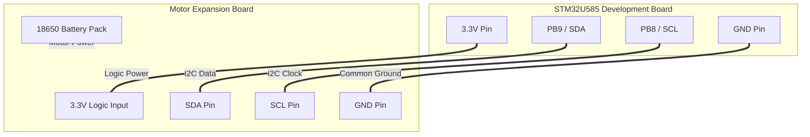

# Motor Control Migration to STM32U5 - Hardware and Software Integration

## 1. Overview
This document describes the analytical process and technical configuration for migrating the motor control interface (PCA9685) and sensors from the Raspberry Pi 5 to the STM32U585.

## 2. Hardware Requirements & Power Analysis

### 2.1 Expansion Board Power
The PWM controller (PCA9685) on the Expansion Board requires an external 3.3V source for its communication logic.
- **Discovery:** The board logic operates at 3.3V, originally provided by the Raspberry Pi.
- **Requirement:** The STM32U5 must provide the **3.3V** (VDD) and **GND** (VSS) lines to power the expansion board's logic interface.

### 2.2 I2C Bus Load & Address Mapping
We verified the total current draw on the STM32's 3.3V regulator and mapped the I2C addresses of all devices on the shared bus.

| Component | Function | I2C Address | Est. Logic Current |
| :--- | :--- | :--- | :--- |
| **PCA9685** | PWM Control | `0x40` (Steering), `0x60` (Motors) | ~10 mA |
| **ADS1115** | Battery Monitor | `0x48` | ~0.2 mA |
| **SSD1306** | OLED Display | `0x3C` | ~5 mA |
| **LM393** | Speed Sensor | N/A (GPIO) | ~2 mA |
| **CAN Module** | MCP2515 (STM32 Side) | SPI1 | ~20 mA |
| **TOTAL** | **Combined Load** | - | **~37.2 mA** |

**Conclusion:** The total load (~17.2 mA) is well within the STM32U585 onboard regulator capacity (>100mA), confirming electrical safety.

## 3. Physical Connections
The diagram below details the physical bridge between the STM32U5 and the Expansion Board.

## 4. Software Configuration (STM32CubeIDE)
Validated firmware parameters and integration findings.

### 4.1 System & Power Parameters
*   **MCU Model:** STM32U585AII6Q
*   **Power Supply:** **SMPS (Mandatory)**. The board B-U585I-IOT02A requires `HAL_PWREx_ConfigSupply(PWR_SMPS_SUPPLY)` for stable operation.
*   **Clock:** **4.0 MHz (MSI Range 4)**. This frequency is stable for both I2C communication and SWV Trace Debugging.
*   **I2C Timing:** `0x00000E14` (calculated for 100kHz I2C with 4MHz source clock).

### 4.2 TrustZone Restrictions (Non-Secure Domain)
*   **GPIO Access:** Accessing **GPIOH** (where LEDs are located) from the Non-Secure domain causes an immediate **Hard Fault**. 
*   **Workaround:** For Non-Secure testing, GPIO ports must be explicitly configured as non-secure or ignored.
*   **Peripheral Linking:** To compile minimal code, dummy handles (structs) for `UART`, `OSPI`, `MDF`, and `PCD` were implemented in `main.c` to satisfy the linker dependencies in `stm32u5xx_it.c`.

### 4.3 Definitive Pin Mapping

| Peripheral | Function | MCU Pins | Detailed Configuration |
| :--- | :--- | :--- | :--- |
| **I2C1** | Motors/Servos (PCA9685) | **PB8** (SCL), **PB9** (SDA) | Standard Mode (100kHz), Non-secure |
| **SPI1** | CAN Controller (MCP2515) | **PE13** (SCK), **PE14** (MISO), **PE15** (MOSI) | Full-Duplex Master |
| **GPIO EXTI** | Speed Sensor (Pulses) | **PB0** | EXTI0, Falling Edge |

## 5. Hardware Validation (Scanner Results)
Bus scan results updated on Jan 22, 2026:
- **0x48** (Battery Monitor): Always detected.
- **0x40** (Steering) & **0x60** (Motors): Detected only when the Expansion Board Battery Switch is **ON**.
- **0x56**: Intermittent detection (possibly a battery management sub-address).

## 6. Safety & Legacy Deactivation
*   **Common Ground:** A common GND connection between STM32 and the Expansion Board is critical for signal integrity.
*   **Trace Debugging:** SWV Trace only works reliably when the IDE's Core Clock is set to match the actual MCU clock (4MHz).
