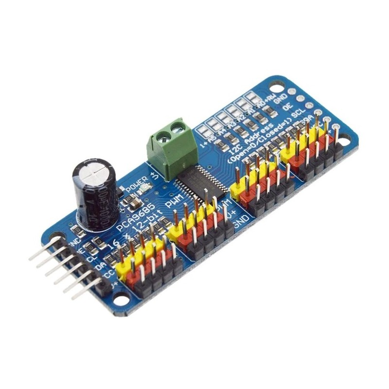

# 🧭 Documentation:  PiRacer control via I2C using C++

## Summary
- [Introduction](#introduction)
- [PCA9685 controller and expansion board](#pca9685-and-expansion-board)
- [DC MOTORS](#dc-motors) 
- [Servo motor control](#servo-motor-control) 
- [Using C++ to control the motors](#using-c++-to-control-the-car)


## Introduction

To control servo motors (steering) and DC motors (traction), our PiRacer uses the PCA9685, a PWM signal controller module located on the expansion board that communicates with the Raspberry Pi via I²C.

The purpose of this document is to explain, in a technical yet accessible way, how PWM control via I²C works, why it is necessary, and how it is integrated into the PiRacer system using C++ code.

####  System Overview

```text
┌───────────────────────────────────────────────────────────┐
│                     Raspberry Pi 5                        │
│  ┌─────────────────────────────────────────────────────┐  │
│  │ C++ Application                                      │  │
│  │  ├─ Uses <linux/i2c-dev.h> → communicates via /dev/i2c-1 │
│  │  ├─ Sends commands through I²C                      │  │
│  │                                                           
│  └─────────────────────────────────────────────────────┘  │
│                   │                         │              │
│                   │ SDA (data)              │ SCL (clock)  │
└───────────────────┼─────────────────────────┼──────────────┘
                    │                         │
                    ▼                         ▼
           ┌─────────────────────────────────────────┐
           │            EXPANSION BOARD              |
           |                                         |
           |             PCA9685 Driver              |
           │ (16-channel PWM controller via I²C)     │
           │  ├─ Receives bytes over I²C             │
           │  ├─ Converts them into PWM signals      │
           │  └─ Generates pulses for each channel   │
           └─────────────────────────────────────────┘
                    │                          │        
     ┌──────────────┘                          │        
     ▼                                         ▼                       
┌────────────┐                  ┌────────────────────────────┐
│ Servo #1   │                  │ DC Motor - H bridge type   │
│ (angle)    │                  │         (speed)            │
└────────────┘                  └────────────────────────────┘
         ▲                             ▲             
         │                             |             
   Powered by the expansion board (battery) 


```


## PCA9685 and expansion board

The PCA9685 is a PWM controller chip integrated in our Expansion Board that is conected whit the motors. In simple terms:

- It generates electrical signals called PWM, which tell motors or servos how fast to spin or what position to move to.

- It has 16 independent channels, meaning it can control up to 16 motors or servos at the same time.

- It works via I²C, so the Raspberry Pi only needs to send commands, and the PCA9685 takes care of generating the precise PWM signals.



As visible in the image, the PCA9685 has 16 independent channels. This means we can program it so that different information can be sent to each of them.

In order to communicate via I²C, each device on the same bus (SCL/SDA) needs to have a unique address. In this code, we use different addresses — 0x40 for the servo and 0x60 for the DC motor — because the expansion board has a dedicated PCA9685 module for each of them.

- The PCA9685 controller for the servo receives information through its channel 0.
- The PCA9685 controller for the two DC motors receives information through channels 0, 1, 2 and 5, 6, 7.

```text
Raspberry Pi (SDA/SCL)
     │
     ├── PCA9685 (0x40) → Servo steering → Channel 0
     │
     ├── PCA9685 (0x60) → DC Motors → Channel 0, 1, 2 and 5, 6, 7

```


## DC MOTORS

Our PiRacer has 2 DC motors, which are responsible for providing traction to the car. This traction can vary, allowing movement forward, backward, and at different speeds.

Each DC motor (left and right) uses three channels of the PCA9685: IN1, IN2, and PWM.

But why three?
Because the PCA9685 is controlling a H-bridge driver.

An H-bridge is an electronic circuit that allows current to flow through a motor in both directions. It is called an "H-bridge" because the circuit diagram resembles the letter "H."

- It allows the motor to rotate forward or backward.

- It also allows controlling the motor’s speed via PWM.

As mentioned this type of motor use 3 signal to work.

### IN1 e IN2 – Forward or Backward


IN1 and IN2 receive digital signals from the PCA9685: HIGH (on) or LOW (off), and they are responsible for controlling the direction in which the motor rotates.

| IN1 | IN2 | Motor Direction      |
|:---:|:---:|:---------------------|
| 1   | 0   | Forward              |
| 0   | 1   | Backward             |
| 0   | 0   | Stop                 |
| 1   | 1   | Stop (brake mode)    |


HIGH means that there is a voltage (3.3V or 5V), and LOW means that there is no voltage (0V).

### PWM - Control the speed

PWM (Pulse Width Modulation) is a digital signal that alternates rapidly between HIGH (on) and LOW (off).

The amount of time the signal stays HIGH determines how much energy the motor receives → it controls the motor’s speed or the servo’s position.

PWM    | Velocidade do Motor | Visual do Pulso
-----------------|-------------------|-------------------
0%               | Stop             | [          ] 0% HIGH
50%              | 50% speed| [#####     ] 50% HIGH
100%             | 100% speed  | [##########] 100% HIGH

## Servo Motor Control


A servo motor is a special type of motor that can rotate to a specific position instead of spinning freely like a DC motor.

It receives PWM signals to set the angular position of the shaft (e.g., 0° to 180)

💡 Unlike a DC motor, a servo does not need an H-Bridge, because it already has an internal circuit to control direction and position.

The servo only looks at the amount of time the pulse stays HIGH within each cycle.

Typical PWM frequency for a servo: 50 Hz (i.e., a 20 ms cycle).

The duration of the HIGH pulse within this cycle determines the servo’s position:

#### Servo PWM Pulse vs Position

| HIGH Pulse (ms) | Servo Position |
|-----------------|----------------|
| 1 ms            | 0° (minimum)   |
| 1.5 ms          | 90° (middle)   |
| 2 ms            | 180° (maximum) |


- Shorter pulses → servo rotates to a smaller position

- Longer pulses → servo rotates to a larger position

# Using C++ to control the motors

This code implements a `PiRacer` class responsible for controlling the **steering (servo motor)** and **throttle (DC motors)**.
Communication with the control modules (**PCA9685** and **INA219**) is done through the **I²C bus**, a widely used protocol for communication between microcontrollers and peripheral devices.

---

## 🧩 Key Dependency


The header `<linux/i2c-dev.h>` is part of the **Linux I²C system**.  

It allows programs running on a **Raspberry Pi** (or other Linux devices) to **communicate with I²C devices**, like sensors or controllers, directly from C/C++ code.  

In the PiRacer project, it is used to:
- Send **PWM commands** to the motor controllers (`PCA9685`)  
- Read **voltage, current, and power** from the battery sensor (`INA219`)  

In short: it connects your C++ code with I²C hardware on the Raspberry Pi.

## ⚙️ General Structure

The `PiRacer` class initializes and manages these main components:

### 🧭 PCA9685 (addresses 0x40 and 0x60)
- Controls **PWM signals** sent to the **servo motor (steering)** and **DC motors (throttle and braking)**.  
- Each PCA9685 is configured to operate at **50 Hz**, the standard frequency for servo control.


### 🚗 Motor Control

🔁 Servo Motor (Steering)

The servo is controlled via:

```cpp
void PiRacer::setSteeringPercent(float percent);
```

- Percent ranges from -1.0 (full left) to 1.0 (full right).

- Internally, the value is converted into a duty cycle between 1 ms and 2 ms, typical for a 50 Hz servo control signal.

Pulse calculation:

```cpp
float PiRacer::_get50HzDutyCycleFromPercent(float value)
{
    return 0.0015 + (value * 0.001);
}
```


0.0015 seconds = neutral position (1.5 ms)


⚡ DC Motors (Throttle and Reverse)

Forward or reverse movement is controlled via:
```cpp
void PiRacer::setThrottlePercent(float percent);
```

- Positive percent → forward

- Negative percent → backward

The code sets the direction control pins (IN1 and IN2) for each motor:

The DC motor control uses proportional PWM based on the value of `percent`.

```cpp
if (percent > 0) {
    // Forward movement
    // IN1 = HIGH, IN2 = LOW
} else {
    // Reverse movement
    // IN1 = LOW, IN2 = HIGH
}

// The absolute value of 'percent' is used to set the speed
int pwmRawValue = PWM_MAX_RAW_VALUE * std::abs(percent);

// Applying PWM to the motors
_throttleController.setPWM(PWM_THROTTLE_CHANNEL_LEFT_MOTOR_IN_PWM, 0, pwmRawValue);
_throttleController.setPWM(PWM_THROTTLE_CHANNEL_RIGHT_MOTOR_IN_PWM, 0, pwmRawValue);
