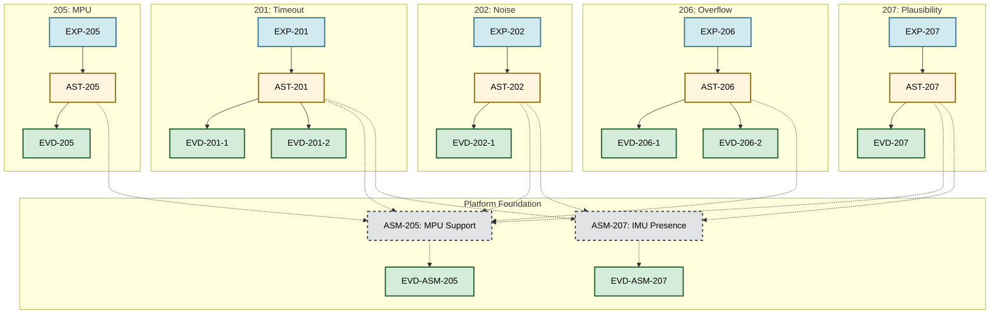

# Requirements and Analysis

This directory serves as the central repository for all project requirements, analysis documents, and supporting evidence, following a structured requirements engineering process.

The goal is to ensure that all aspects of the system are well-defined, traceable, and verifiable.

## Directory Structure and Workflow

The subdirectories are organized to reflect a logical workflow for requirements definition and verification.

**Typical Workflow:**
`Templates` -> `HARA` -> `Expectations` -> `Assertions` / `Assumptions` -> `Tests` -> `Evidences`

-   **[`/templates/`](./templates/)**: Provides standardized templates for creating new requirement and analysis documents.

-   **[`/HARA/`](./HARA/)**: Contains all Hazard Analysis and Risk Assessment (HARA) documents for the project.

-   **[`/expectations/`](./expectations/)**: Describes high-level expectations of the system's behavior from a user or stakeholder perspective.

-   **[`/assertions/`](./assertions/)**: Contains formal, verifiable assertions about the system's properties, which are derived from the higher-level expectations.

-   **[`/assumptions/`](./assumptions/)**: Documents all assumptions made during the design and development process.

-   **[`/test/`](./test/)**: Contains requirement-level test cases designed to verify that the defined assertions and expectations are met.

-   **[`/evidences/`](./evidences/)**: Holds formal evidence artifacts (e.g., final test reports, validation documents) that prove high-level requirements are met. This closes the verification loop.

---

## 🗺️ Traceability Maps

### Speedometer Integration
The diagram below illustrates the full traceability from expectations to final evidence for [Goal 1 of Module 01 - SEAME 2025](https://github.com/SEAME-pt/contents-2025/tree/main/01_SwArchitecture4Automotive).

---

## 🛡️ Trustable Framework (TSF) Validators

The project uses the **Eclipse Trustable Software Framework (TSF)** to automatically calculate confidence scores. The following custom validators are implemented in `.dotstop_extensions/validators.py`:

### 1. `test_log_validator` (Runtime Evidence)
Used for technical proofs generated by scripts or system execution.
- **Logic**: Returns **1.0** if it finds the keyword `PASS` in the log, and **0.0** if it finds `FAIL`.
- **Usage**: Validating time-sensitive behaviors like sensor timeouts.

### 2. `static_analysis_validator` (Code Quality Evidence)
Used to verify reports from static analysis tools like `cppcheck` or `lint`.
- **Logic**: Returns **1.0** if it finds a success pattern (default: `0 errors`) in the report file.
- **Usage**: Validating safety-critical code patterns and overflow prevention.

### 3. `reviewer_score` (Process Evidence)
Used for manual gates, such as peer reviews or datasheet inspections.
- **Logic**: Returns **1.0** if the metadata field `result` is explicitly set to `PASS` in the YAML configuration.
- **Usage**: Validating hardware specifications and manual design reviews.

---
-   **[`statements-viewer.md`](./statements-viewer.md)**: A document likely related to viewing or interpreting the various requirement statements.

### Related Documentation

-   **`docs/Decision_support/`**: While formal evidence resides here in `/evidences`, the `docs/Decision_support/` directory holds detailed engineering-level justifications, research, and rationale for specific design decisions made during analysis (e.g., justifying a specific HARA failure mode).
